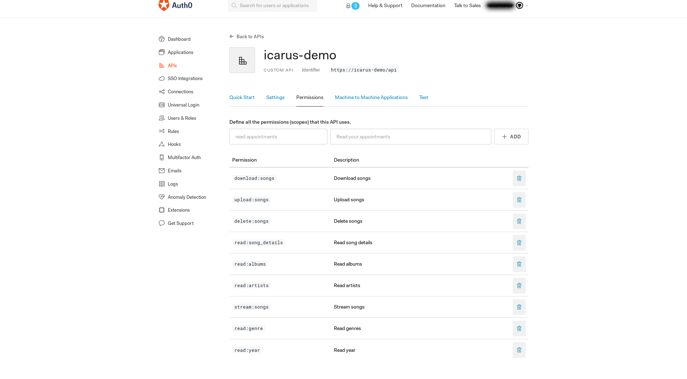
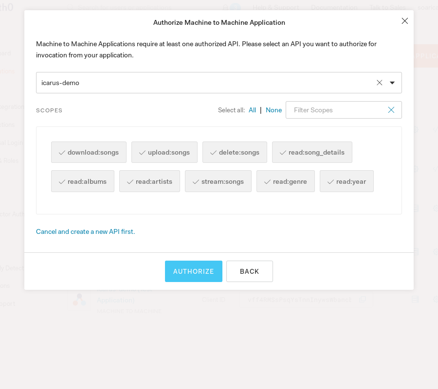

# Icarus

Icarus is a music streaming API Server that interacts with [Mear](https://github.com/amazing-username/mear).

### Interfacing With Icarus

One can interface with Icarus the music server either by:

* [Mear](https://github.com/amazing-username/mear) - Partially implemented (under development)
* [IcarusDownloadManager](https://github.com/amazing-username/IcarusDownloadManager)


## Built With


* C#
* [.NET Core](https://dotnet.microsoft.com/) 2.2
* .NET Web RESTful API
* [MySql](https://www.nuget.org/packages/MySql.Data/)
* [Newtonsoft.Json](https://www.newtonsoft.com/json)
* [TagLib#](https://github.com/mono/taglib-sharp)


## Getting started
There are several things that need to be completed to properly setup and secure the API.
1. Auth0 API configuration
2. API filesystem paths
3. Database connection string
4. Migrations

### Auth0 API configuration

Securing Icarus is required, preventing the API from being publicly accessible. To do so, create an Auth0 account (it's free), for the sake of this section of the documentation, I will not go over how to create an Auth0 account. Once created, create a tentant and proceed to create an API
<h1 align=center>
    
</h1>

Create the API and enter an approrpiate name and identified. For the identified, append **api** like in the example
<h1 align="center">
    
</h1>
Replace [domain] with the domain name of the created tenant. This can be found in the Default App from the Application menu. Replace [identifier] with the identifer root name in the appsettings environment file. Not the friendly name but the root name of the identifier, omitting the http protocol and the *api* path.

```Json
  "Auth0": {
	  "Domain": "[domain].auth0.com", 
	  "ApiIdentifier": "https://[identifier]/api"
  },
```

For the sake of this section, I will not go over configuring the API to accept the signing algorithm since it has already been configured in the [Startip](Startup.cs).cs file. Click on permissions to create the permissions for the API.
<h1 align "center">
    
</h1>

The permissions ensure that a validated user can interact with the API with a token that has not expired. Ensure that the permissions match, the description can change but the permission identifier must match.
<h1 align="center">
    
</h1>

On the left side, click on Application and create a new Application. Choose the Machine to Machine Application
<h1 align="center">
    
</h1>

With the grant permissions you created from the API, enable all the permissions. This is important because if they are not enabled then even with a valid token the request will return 403 (unauthorized)
<h1 align="center">
    
</h1>

From the Application page, copy the client id and client secret. These values will be used for the API to interact with API.
<h1 align="center">
    
</h1>
Enter the information in the corresponding appsettings json file
```Json
  "Auth0": {
	  "ClientId":"",
	  "ClientSecret":""
  },
```

### API filesystem paths

For the purposes of properly uploading, downloading, updating, deleting, and streaming songs the API filesystem paths must be configured. What is meant by this is that the `RootMusicPath` directory where all music will be stored must exist as well as the `ArchivePath` and `TemporaryMusicPath` paths. An example on a Linux system:
```Json
{
  "RootMusicPath": "/home/dev/null/music/",
  "TemporaryMusicPath": "/home/dev/null/music/temp/",
  "ArchivePath": "/home/dev/null/music/archive/"
}
```
* RootMusicPath - Where music will be stored in the following convention: *`Artist/Album/Songs`*
* TemporaryMusicPath - Where music will be stored when uploding songs to the server until the metadata has been fully parsed and entered into the database. Upon completion the files will be deleted and moved to the appropriate path in the `RootMusicPath`
* ArchivePath - When downloading compressed songs this is the path where songs will be compressed prior to dataa being read into memory, deleting the compressed file, and sending the compressed file from memory to the client


**Note**: The `TemporaryMusic` or `ArchivePath` does not have to be located in the `RootMusicPath`. Ensure that the permissions are properly set for all of the paths.

### Database connection string

In order for Database functionality to be operable, there must be a valid connection string and credentials with appropriate permissions. **At the moment there is only support for MySQL**. Depending on your environment `Release` or `Debug` you will need to edit the appsettings.json or appsettings.Development.json accordingly. An example of the fields to change are below:
```Json
{

  "ConnectionStrings": {
	  "DefaultConnection": "Server=localhost;Database=my_db;Uid=admin;Pwd=toughpassword;"
  }
 
}
```
* Server - The address or domain name of the MySQL server
* Database - The database name
* Uid - Username
* Password - Self-explanatory

The only requirement of the User is that the user should have full permissions to the database as well as permissions to create a database. Other than that, that is all that is required.

### Migrations

Prior to starting the API, the Migrations must be applied. There are 6 tables with migrations being applied and thy are:
* Users
* Song
* Album
* Artist
* Year
* Genre

There is a script for Linux systems to apply these migrations, it can be found in the [Scripts/Migrations/Linux](https://github.com/amazing-username/Icarus/blob/master/Scripts/Migrations/Linux/AddUpdate.sh) directory. Just merely execute:
```shell
scripts/Migrations/Linux/AddUpdate.sh
```
Or you can manually add the migrations like so for each migration:
```shell
dotnet ef migrations Add [Migration] --context [Migration]Context
```
Then update the migrations to the database like so<sup>*</sup>:
```shell
dotnet ef database update --context [Migration]Context
```
From this point the database has been successfully configured. Metadata and song filesystem locations can be saved.

<sup>*</sup> Will only need to execute this for UserContext and SongContext because the Song table has relational constraints with Album, Artist, Year, and Genre.

## Contributing

Please read [CONTRIBUTING.md](CONTRIBUTING.md) for details on the code of conduct, and the process for submitting pull requests to the project.

## Versioning

Currently under development. No version has been released

## Authors

* **Kun Deng** - [amazing-username](https://github.com/amazing-username)

See also the list of [contributors](https://github.com/amazing-username/Icarus/graphs/contributors) who participated in this project.

## License

This project is licensed under the MIT License - see the [LICENSE](LICENSE) file for details

